# EsiFit — DATA_MODEL.md

This is drawn **before the real backend (Phase 6)** so that every phase's mock data shape is consistent with a single underlying structure, instead of each phase inventing its own shape. When Phase 6 builds the real Prisma schema, it should map directly onto this diagram — updating it here first if reality requires a change, not silently diverging.

## Core ER Diagram

```mermaid
erDiagram
    USER ||--o{ WORKOUT_LOG : logs
    USER ||--o{ NUTRITION_LOG : logs
    USER ||--o{ WEIGHT_LOG : logs
    USER ||--o{ SLEEP_LOG : logs
    USER ||--o{ WATER_LOG : logs
    USER ||--o{ GOAL : sets
    USER ||--o{ CALCULATOR_RESULT : saves
    USER ||--o{ USER_BADGE : earns
    USER ||--o{ XP_LOG : accrues
    USER ||--o{ CHALLENGE_PARTICIPANT : joins
    USER ||--o{ POST : authors
    USER ||--o{ COMMENT : authors
    USER ||--o{ NOTIFICATION : receives
    USER ||--o{ AI_USAGE_LOG : generates
    USER }o--|| ROLE : has

    ROUTINE ||--o{ ROUTINE_EXERCISE : contains
    ROUTINE_EXERCISE }o--|| EXERCISE : references
    WORKOUT_LOG }o--|| ROUTINE : based_on
    WORKOUT_LOG ||--o{ SET_LOG : contains
    SET_LOG }o--|| EXERCISE : targets
    EXERCISE }o--o{ MUSCLE_GROUP : targets

    NUTRITION_LOG ||--o{ MEAL_ENTRY : contains
    MEAL_ENTRY }o--|| FOOD : references

    CHALLENGE ||--o{ CHALLENGE_PARTICIPANT : has
    POST ||--o{ COMMENT : has
    POST ||--o{ LIKE : has

    ARTICLE }o--|| AUTHOR : written_by
    ARTICLE }o--|| CATEGORY : belongs_to

    BADGE ||--o{ USER_BADGE : awarded_as
    MISSION ||--o{ USER_MISSION_PROGRESS : tracked_by

    USER {
        string id PK
        string email
        string name
        string role_id FK
        string tier
        date created_at
    }
    ROLE {
        string id PK
        string name
    }
    EXERCISE {
        string id PK
        string name
        string equipment
        string difficulty
    }
    MUSCLE_GROUP {
        string id PK
        string name
    }
    ROUTINE {
        string id PK
        string user_id FK
        string name
    }
    WORKOUT_LOG {
        string id PK
        string user_id FK
        string routine_id FK
        date performed_at
        int duration_seconds
    }
    SET_LOG {
        string id PK
        string workout_log_id FK
        string exercise_id FK
        float weight
        int reps
        boolean is_pr
    }
    FOOD {
        string id PK
        string name
        float protein_g
        float carbs_g
        float fat_g
        float calories
    }
    NUTRITION_LOG {
        string id PK
        string user_id FK
        date logged_at
    }
    MEAL_ENTRY {
        string id PK
        string nutrition_log_id FK
        string food_id FK
        float serving_size
        string meal_slot
    }
    WEIGHT_LOG {
        string id PK
        string user_id FK
        float weight_kg
        date logged_at
    }
    SLEEP_LOG {
        string id PK
        string user_id FK
        float hours
        date logged_at
    }
    WATER_LOG {
        string id PK
        string user_id FK
        float ml
        date logged_at
    }
    GOAL {
        string id PK
        string user_id FK
        string type
        float target_value
        date target_date
    }
    CALCULATOR_RESULT {
        string id PK
        string user_id FK
        string calculator_type
        json inputs
        json result
        date created_at
    }
    BADGE {
        string id PK
        string name
        string criteria
    }
    USER_BADGE {
        string id PK
        string user_id FK
        string badge_id FK
        date earned_at
    }
    MISSION {
        string id PK
        string name
        string period
        json criteria
    }
    USER_MISSION_PROGRESS {
        string id PK
        string user_id FK
        string mission_id FK
        int progress
        boolean claimed
    }
    XP_LOG {
        string id PK
        string user_id FK
        int amount
        string source
        date created_at
    }
    CHALLENGE {
        string id PK
        string name
        date start_date
        date end_date
    }
    CHALLENGE_PARTICIPANT {
        string id PK
        string challenge_id FK
        string user_id FK
        int score
    }
    POST {
        string id PK
        string user_id FK
        string content
        string image_url
        date created_at
    }
    COMMENT {
        string id PK
        string post_id FK
        string user_id FK
        string content
    }
    LIKE {
        string id PK
        string post_id FK
        string user_id FK
    }
    NOTIFICATION {
        string id PK
        string user_id FK
        string type
        string message
        boolean is_read
    }
    ARTICLE {
        string id PK
        string title
        string slug
        string author_id FK
        string category_id FK
        date published_at
    }
    AUTHOR {
        string id PK
        string name
        string bio
    }
    CATEGORY {
        string id PK
        string name
    }
    AI_USAGE_LOG {
        string id PK
        string user_id FK
        string provider
        string model
        int prompt_tokens
        int completion_tokens
        date created_at
    }
```

## Notes for frontend phases (2–5)

- Mock data generated by the Phase 3 seed script should mirror these entities/fields exactly (field names, types) — so Phase 6's real Prisma schema is close to a direct translation, not a redesign.
- `tier` on `USER` drives dashboard widget visibility (Phase 2) and AI quota (Phase 5) — keep it as a single source of truth field, not duplicated logic in multiple places.
- `CALCULATOR_RESULT` and `AI_USAGE_LOG` exist specifically to support the sign-in-gated history/comparison feature (Phase 3) and the quota/logging requirement (Phase 5) — don't invent a parallel shape for either.

## When this changes

If a phase discovers a field/entity this diagram is missing, update this file in that phase's handoff rather than letting the mock data silently diverge from it.
